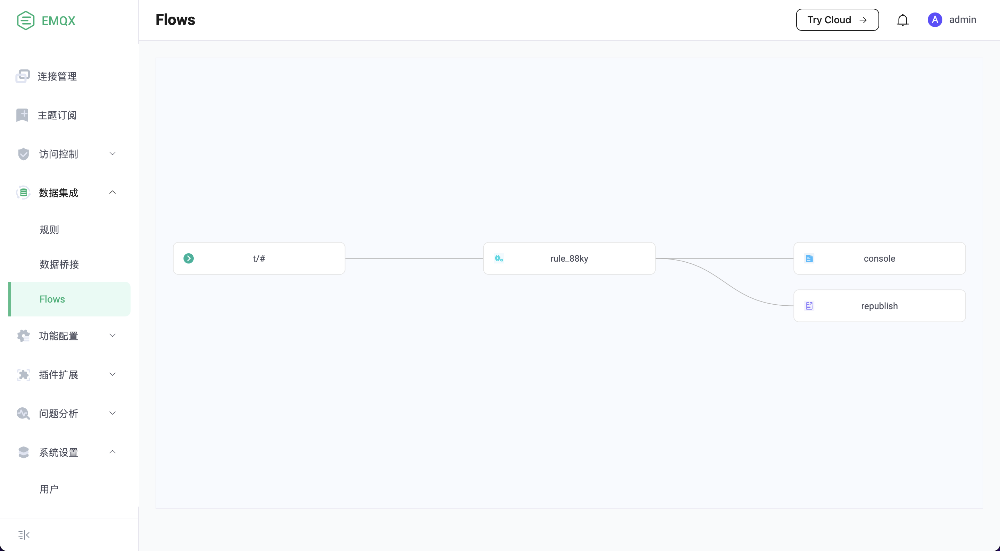
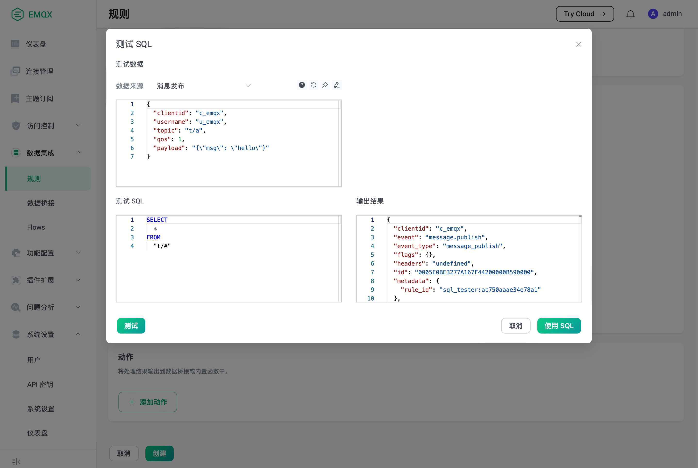

# 规则引擎简介

EMQX 规则引擎用于配置消息与事件的处理规则。规则引擎提供了清晰、灵活的 "配置式" 的数据集成方案，无需代码开发即可处理简单的数据业务。使用规则引擎结合数据桥接功能，可快速对接外部数据系统，实现物联网数据的移动和处理。


## 规则引擎的组成

规则描述了 **数据来源**、**数据处理过程**、**处理结果去向** 三个方面：

- 数据来源：规则的数据源可以是消息或事件，也可以是外部的数据系统，通过 SQL 的 FROM 子句指定消息主题或者事件类型；
- 数据处理过程：规则通过 SQL 语句来描述数据处理过程。规则使用 SQL 的 WHERE 字句过滤数据，使用 SELECT 子句以及 SQL 函数从消息或事件的上下文中提取和转换数据；
- 处理结果去向：规则可以定义一个或多个动作来处理 SQL 的输出结果。如果 SQL 执行通过，规则将按顺序执行相应的动作。规则引擎提供了多种动作，比如将处理结果存储到数据库、或者重新发布到另一个 MQTT 主题等。

## 配置规则

通过修改配置文件 `emqx.conf`，可以在 EMQX 启动之前配置规则。规则的配置结构如下所示：

```js
rule_engine {
    rules.foo {
        sql = "SELECT * FROM \"t/#\""
        actions = []
    }
    rules.bar {
        sql = "SELECT * FROM \"t/#\""
        actions = []
    }
}
```

在 `rule_engine` 命名空间下，使用 `rules` 配置项可以创建多个规则。其中 `foo` 和 `bar` 是规则的 ID，必须是字母数字下划线的组合。在每个规则的定义里面，`sql` 字段用于定义规则的 SQL 语句。`action` 字段是一个数组，可定义一个或多个动作。

### SQL 语句

SQL 语句用于指定规则的数据来源、定义数据处理过程。下面给出了一个 SQL 语句的例子：

```SQL
SELECT
    payload.data as d
FROM
    "t/#"
WHERE
    clientid = "foo"
```

在上述 SQL 语句里：

- 数据来源：主题为 `t/#` 的消息；
- 数据处理过程：如果发送消息的客户端 ID 为 `foo`，则从消息内容中选出 `data` 字段并赋值给新的变量 `d`。

::: warning
注意 "." 语法要求数据必须是 JSON 或者 Map 类型，如果是其他数据类型，须要使用 SQL 函数做数据类型转换。
:::

关于规则引擎的 SQL 语句格式和用法，详见 [SQL 手册](./rule-engine_grammar_and_examples.md)。

### 动作

规则里的动作有以下两种：
- 内置动作：`republish` 和 `console`；
- 数据桥接：数据桥接是通往外部数据系统的通道，规则可以直接使用数据桥接的 ID 作为动作。

对于内置动作，须要在 `actions` 字段里配置一个包含 `function` 字段的 Object：

```js{1-4,15-17}
rule_engine {
    rules.my_rule_id {
        sql = "SELECT * FROM \"t/#\""
        actions = [
            {
                function = console
            },
            {
                function = republish
                args = {
                    topic = "a/1"
                    payload = "${payload}"
                }
            }
        ]
    }
}
```

其中 `function` 字段为动作的名字。`args` 字段为动作的参数列表。
`republish` 动作须要指定消息主题和消息内容等参数，而 `console` 动作不需要任何参数。

在动作里，可以使用 `${some_key}` 的形式来引用 SQL 结果中的变量。因为这里 SQL 语句使用 `SELECT *`
输出了所有可用的字段，所以我们可以使用 `${payload}` 来获取原来消息里的消息内容，
或者使用 `${clientid}` 来获取发送消息的客户端 ID。规则引擎支持的事件类型以及可用字段请参见：[事件主题和可用字段](./rule-engine_field.md)

关于内置动作的细节，详见 [内置动作](./rule-engine_builtin_actions.md)

若把数据桥接作为动作，须要在 `actions` 字段里配置数据桥接的 ID：

```js{1-3,5-6}
rule_engine {
    rules.my_rule_id {
        sql = "SELECT * FROM \"t/#\""
        actions = ["mqtt:my_mqtt_bridge"]
    }
}
```

其中 `mqtt:my_mqtt_bridge` 是一个数据桥接的 ID，其类型为 `mqtt`、名字为 `my_mqtt_bridge`。

使用数据桥接之前，须要预先创建。关于数据桥接的细节，详见 [数据桥接](./data-bridge.md)

## 使用规则处理消息

我们可以使用规则引擎处理特定主题的消息。下面给出了一个处理 MQTT 消息的规则的示例。

在 `emqx.conf` 配置文件的最后，添加如下配置：

```js
rule_engine {
    rules.my_republish_rule {
        sql = "SELECT qos, payload.x as y FROM \"t/a\""
        actions = [
            {
                function = republish
                args = {
                    topic = "t/b"
                    qos = "${qos}"
                    payload = "y: ${y}"
                }
            }
        ]
    }
}
```

该配置创建了一个名为 "my_republish_rule" 的规则。这个规则从主题为 `t/a` 的消息内容中筛选出 `x` 字段，并赋值给 `y`。

其中 `actions` 参数定义了规则执行成功时会触发的动作: 重新发布（republish）。

现在如果发送一条内容为 `{"x": 1}`，QoS 为 0 的消息（JSON 格式）到主题 `t/a`, 就会匹配到该规则。
规则首先执行 SQL 语句，从消息上下文中选取 `qos` 字段，并提取 `payload` 里的 `x` 字段赋值给变量 `y`，最后触发 `republish` 动作发送一条消息到主题 `t/b`，消息内容为字符串 `y: 1`（因为 `payload.x = 1`），QoS 为 0。

## 使用规则处理事件

规则引擎使用 **$events/** 开头的**事件主题**处理 EMQX 事件。下面给出了一个处理“客户端上线”事件的规则的示例。

在 `emqx.conf` 配置文件的最后，添加如下配置：

```js
rule_engine {
    rules.client_connected_webhook {
        sql = "SELECT clientid, connected_at FROM \"$events/client_connected\" WHERE username = 'emqx'"
        actions = [
            "webhook:my_webhook"
        ]
    }
}
```

该配置定义了一个 ID 为 "client_connected_webhook" 的规则。
这个规则从事件上下文中选取出 "clientid" 和 "connected_at" 两个字段，然后通过 WebHook 将其转发给 HTTP 服务器。

注意这里 `actions` 字段配置了 `webhook:my_webhook`，是一个数据桥接的 ID，其类型为 `webhook`、名字为 `my_webhook`。使用数据桥接之前，须要预先创建。关于数据桥接的创建和使用，详见 [数据桥接](./data-bridge.md)。

除了客户端上下线事件以外，规则引擎还支持订阅和取消订阅、消息投递等事件。
规则引擎支持的事件类型以及可用字段请参见：[事件主题和可用字段](./rule-engine_field.md)

## 把数据桥接作为数据源

有些数据桥接（如 MQTT 桥接）也可以作为规则引擎的数据源，规则引擎使用 **$bridges/** 开头的**数据桥接主题**处理由数据桥接触发的事件。下面给出了一个把 “MQTT 桥接” 作为数据源的规则的示例。

在 `emqx.conf` 配置文件的最后，添加如下配置：

```js
rule_engine {
    rules.receive_msgs_from_remote_mqtt_broker {
        sql = "SELECT * FROM \"$bridges/mqtt:my_mqtt_source\" WHERE username = 'emqx'"
        actions = [{function = console}]
    }
}
```

这个示例创建了一个 ID 为 `receive_msgs_from_remote_mqtt_broker` 的规则，
SQL 语句里指定了一个数据桥接主题：`$bridges/mqtt:my_mqtt_source`，
其中 `mqtt:my_mqtt_source` 是一个 MQTT 桥接的 ID，其类型为 `mqtt`、名字为 `my_mqtt_source`。
该规则在最后调用了 `console` 动作，这是一个调试动作，会把 SQL 语句筛选出的所有字段打印到 emqx 控制台里。

使用数据桥接之前，须要预先创建。关于数据桥接的细节，详见 [数据桥接](./data-bridge.md)

## 在 Dashboard 上创建和使用规则

除了使用配置文件创建规则之外，也可以在 Dashboard 上创建和管理规则，更加直观和方便。

在 Dashboard 上，选择数据集成 -> 规则 -> 创建，进入创建规则引擎的界面：


填写好 SQL 语句和动作参数之后，点击页面下方的创建按钮。在左侧的 Flows 页面上可以查看规则的拓扑图：



## 在 Dashboard 上测试 SQL 语句

EMQX 提供了在 Dashboard 上测试 SQL 语句的功能。在规则创建页面，点击“测试 SQL”，通过给定的 SQL 语句和事件参数，即时展示 SQL 的测试结果。



SQL 的处理结果会以 JSON 的形式呈现在 **测试输出** 文本框里。在后续的动作（内置动作或者数据桥接）里面，可以 `${key}` 的形式引用 SQL 处理结果里的字段。

## 规则引擎典型应用场景举例

- 动作监听：智慧家庭智能门锁开发中，门锁会因为网络、电源故障、人为破坏等原因离线导致功能异常，使用规则引擎配置监听离线事件向应用服务推送该故障信息，可以在接入层实现第一时间的故障检测的能力；
- 数据筛选：车辆网的卡车车队管理，车辆传感器采集并上报了大量运行数据，应用平台仅关注车速大于 40 km/h 时的数据，此场景下可以使用规则引擎对消息进行条件过滤，向业务消息队列写入满足条件的数据；
- 消息路由：智能计费应用中，终端设备通过不同主题区分业务类型，可通过配置规则引擎将计费业务的消息接入计费消息队列并在消息抵达设备端后发送确认通知到业务系统，非计费信息接入其他消息队列，实现业务消息路由配置；
- 消息编解码：其他公共协议 / 私有 TCP 协议接入、工控行业等应用场景下，可以通过规则引擎的本地处理函数（可在 EMQX 上定制开发）做二进制 / 特殊格式消息体的编解码工作；亦可通过规则引擎的消息路由将相关消息流向外部计算资源如函数计算进行处理（可由用户自行开发处理逻辑），将消息转为业务易于处理的 JSON 格式，简化项目集成难度、提升应用快速开发交付能力。
